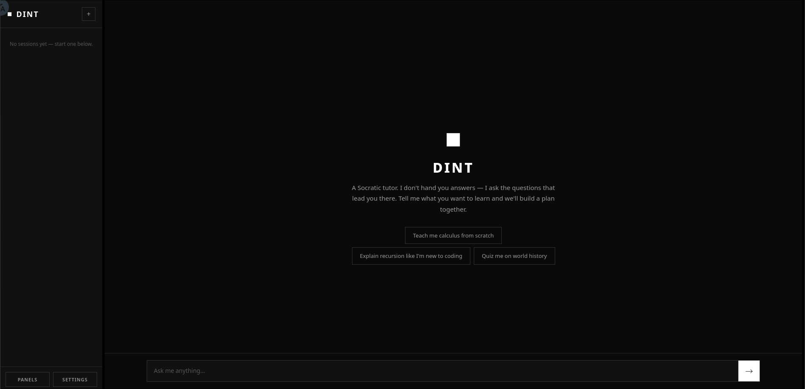

<p align="center">
  <h1 align="center">dint</h1>
  <p align="center">
    <strong>The AI tutor that refuses to give you the answer.</strong>
  </p>
</p>

<p align="center">
  <a href="https://pypi.org/project/dint/"></a>
  <a href="https://pypi.org/project/dint/"></a>
  <a href="https://github.com/safe049/dint/blob/main/LICENSE"></a>
</p>

<p align="center">
  
</p>

---

You ask ChatGPT how bubble sort works. It dumps code. You copy it. You feel
smart. You learn nothing. By Thursday, you can't explain it to a rubber duck.

**dint is the opposite.** You ask it how bubble sort works, and it hands you
five numbers and says *"sort them. you can only swap neighbors. go."* You
fumble. You trace. You figure it out. And when the code finally appears, you
read it and think *yeah, that's the thing I just built.*

dint doesn't transmit knowledge. It builds it in your head, brick by brick,
while you do the lifting.

## What a session actually looks like

> **You:** Teach me what a variable is. I've never written code.
>
> **dint:** Okay. Sit down. No code today. Not yet.
>
> You're trying to cut back on coffee, so you grab a sticky note, write
> "cups" at the top, and every time you finish one, you update the number.
> Morning: 0. After your second cup: 2. By 4pm you're at 4 and your hands
> are shaking a little.
>
> That sticky note. The word "cups" never changed. The number kept changing.
> There are two things on that note, and they're different things. One stays
> put. One moves. Can you name those two for me?
>
> **You:** the cups is the variable name and that number is a value
>
> **dint:** Yeah. That's it. You just described a variable without ever
> seeing a line of code, and you used the right words for both parts.
> So that's not luck — you actually see it.
>
> *(...the lesson continues through sticky notes on a fridge, three
> variables, mutation, `x = x + 5`, and ends with types — all before
> the learner sees more than four lines of code...)*
>
> **dint:** Go rest. You earned the cold coffee. Come back when you're ready.

No "Great question!" No code dump. No "Is there anything else I can help you
with?" Just a teacher, a sticky note, and the quiet satisfaction of watching
someone's face change when an idea lands.

## Quick start

```bash
pip install dint
```

```bash
dint
```

Open **http://localhost:7070**. Set your API key in **Settings**. Start
learning.

Works with any OpenAI-compatible API — OpenAI, OpenRouter, Groq, Together,
or a local [Ollama](https://ollama.com) server.

### Multi-user mode

Want to host dint for a classroom, a study group, or your friends?

```bash
dint --multi-user
```

Each visitor registers an account and gets a fully isolated learning
environment — their own memory, skills, knowledge graph, and sessions.
The operator's API key stays hidden from tenants. Per-user data lives under
`users/<username>/`.

## What dint actually does

<table>
<tr>
<td width="33%">

**Socratic dialogue**

Decomposes every topic into small, concrete concepts. Grounds each one in
something you can hold in your head — five numbers, three cards, one sticky
note. Asks you to predict, trace, and decide before revealing anything. The
code shows up last, as confirmation. Not as the lesson.

</td>
<td width="33%">

**Spaced repetition (SM-2)**

Schedules review questions for skills you've demonstrated. Come back three
days later and it opens with *"quick — what's the base case in recursion?"*
Get it right, the next review moves further out. Get it wrong, it circles
back tomorrow. Knowledge that isn't revisited decays. dint doesn't let it.

</td>
<td width="33%">

**Knowledge graph**

Every concept gets added to an interactive force-directed graph — nodes and
edges, how ideas connect. Pan, zoom, drag nodes, right-click to rename or
delete. "Binary search" links to "sorted array" links to "comparison." The
graph grows as you learn.

</td>
</tr>
<tr>
<td>

**Long-term memory**

Remembers you across sessions. Your goals, what you already know, how you
like to be taught, the mistakes you keep making. Reads its notes before each
session so it never re-teaches what you've already demonstrated.

</td>
<td>

**Background reflection**

After every exchange, a quiet analysis pass updates dint's model of you —
skill confidence, knowledge links, durable memories. It detects when you
*claim* to understand but your behavior says otherwise, and corrects its
own stale beliefs. You don't see any of this.

</td>
<td>

**Memory consolidation**

Every ~10 turns, dint reviews its entire inventory of memories, skills, and
concepts. Near-duplicates get merged. Stale entries get pruned. The model
stays compact and honest over months of use. You can also trigger it
manually from Settings.

</td>
</tr>
<tr>
<td>

**Adaptive teaching**

dint watches *how* you think, not just what you know. It notices you skip
steps when tracing algorithms. It notices you learn better from analogies
than formal definitions. It adjusts its approach per learner, per session,
per concept.

</td>
<td>

**Multi-user isolation**

Run `dint --multi-user` and every visitor gets their own account, their own
database, their own learning history. The operator's API key is invisible to
tenants. PBKDF2 password hashing, session tokens, per-user data directories.

</td>
<td>

**Bilingual (EN / 中文)**

Full UI localization in English and Chinese. Toggle with one click. The
teaching persona adapts to whatever language you write in. dint teaches you
in your language, not its own.

</td>
</tr>
</table>

**The loop:**

```
You send a message
        │
        ▼
┌─────────────────────────────────────────────┐
│  Agent assembles context:                   │
│  persona + memories + skills + knowledge    │
│  + skills due for review (SM-2)             │
└─────────────────┬───────────────────────────┘
                  ▼
┌─────────────────────────────────────────────┐
│  LLM responds, calling tools as needed:     │
│  memory · skills · knowledge · search ·     │
│  concept tracking · review scheduling       │
└─────────────────┬───────────────────────────┘
                  ▼
┌─────────────────────────────────────────────┐
│  Reply streams back token by token (SSE)    │
└─────────────────┬───────────────────────────┘
                  ▼
┌─────────────────────────────────────────────┐
│  Background reflection (async, non-blocking)│
│  → skill confidence · knowledge edges ·     │
│    durable memories · overclaiming check ·  │
│    belief correction · SM-2 scheduling      │
└─────────────────┬───────────────────────────┘
                  ▼
┌─────────────────────────────────────────────┐
│  Consolidation check (10% per turn)         │
│  → merge duplicates · prune stale entries · │
│    keep the model compact and honest        │
└─────────────────────────────────────────────┘
```

## Configuration

| Variable | Description | Default |
|----------|-------------|---------|
| `OPENAI_API_KEY` | API key for your provider | *(required)* |
| `OPENAI_BASE_URL` | OpenAI-compatible endpoint | `https://api.openai.com/v1` |
| `DINT_MODEL` | Model for teaching (must support tool calling) | `gpt-4o-mini` |
| `REFLECT_MODEL` | Model for background reflection | *(same as DINT_MODEL)* |
| `DATABASE_URL` | SQLite database path | `dint.db` |
| `MAX_TOOL_ROUNDS` | Max tool-call rounds per turn | `8` |
| `WEB_SEARCH_RESULTS` | Results per web search | `5` |
| `DINT_TEMPERATURE` | Sampling temperature | `0.7` |

All settings are also editable at runtime through the **Settings** panel in
the web UI. Changes take effect immediately.

In **multi-user mode**, the API key and base URL are operator-owned and
hidden from tenants. Each user can configure their own model, temperature,
and behaviour knobs.

## CLI options

```
dint [--host HOST] [--port PORT] [--multi-user]
```

| Flag | Description | Default |
|------|-------------|---------|
| `--host` | Bind address | `0.0.0.0` |
| `--port` | Port to listen on | `7070` |
| `--multi-user` | Enable multi-user mode with accounts | *(single-user)* |

## Requirements

- **Python 3.10+**
- An OpenAI-compatible API key (OpenAI, OpenRouter, Groq, Ollama, etc.)
- The model must support **tool / function calling**

## The name

*dint* — as in *"by dint of."* Through force of your own effort.

You don't learn by being told. You learn by dint of thinking.

---

<p align="center">
  <sub>MIT Licensed</sub>
</p>
